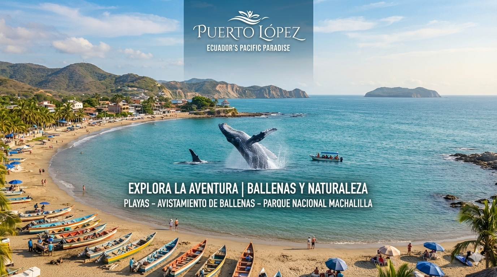

#  Sitio Web Turístico "Puerto Lopez"

 Gabriel José Santacruz Pesantes

 Manabí / Puerto López y Atractivos

Plataforma web promocional e informativa diseñada para destacar los principales atractivos turísticos, servicios y valores del destino puerto López. Incluye interfaz adaptativa (responsive) para escritorio, tabletas y dispositivos móviles, así como formulario de contacto y menús interactivos.

**Tecnologías utilizadas:**
* HTML5 (Estructuración semántica)
* CSS3 (Flexbox, CSS Grid, Media Queries, Animaciones y Hoja de estilos externa)
* Git & GitHub (Control de versiones)
* GitHub Pages (Despliegue y hosting público)
**Captura del sitio:**

**URL del sitio publicado:**
https://gabriel-santacruz.github.io/examen-final-turismo/
